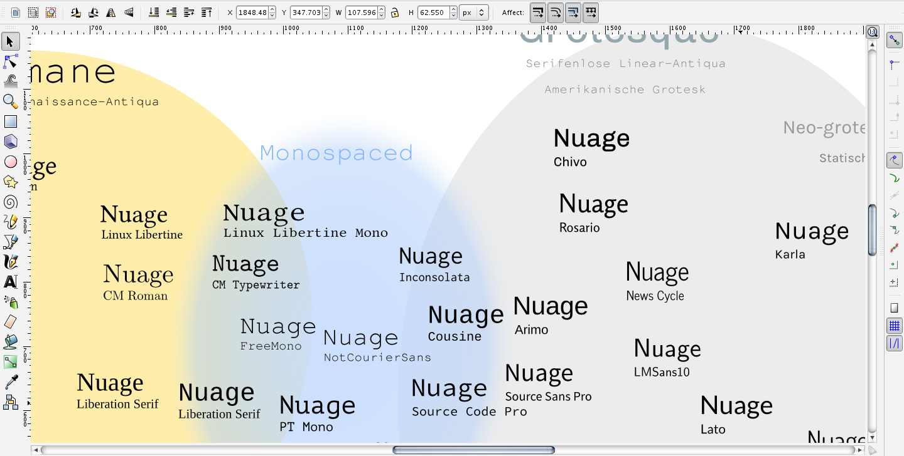

## About

This Libre Type Classification Map was initiated during a collaborative work session (Open Graphics Night) at Dock18, Zurich, on June 14 2013.

It follows investigations on type classification, related to the [Libre Type Specimen Book](http://greyscalepress.com/2013/books/eve-future-specimens-de-fontes-libres/) project.

## License
This map is licensed under a [Creative Commons Attribution-ShareAlike 3.0 Unported License](http://creativecommons.org/licenses/by-sa/3.0/).
The font outlines are covered by their respective licences (mostly SIL OFL, GNU GPL with font exception, Apache).

## History
- 2013-06-14 : first draft, created at Dock18 by Manuel Schmalstieg and Marco Müller

## Links
### Resources
- [Notes on type taxonomies](http://titanpad.com/type-taxonomies)
- A [survey of personal classification methods](http://titanpad.com/type-taxonomies-survey)
### Contributors
- Manuel Schmalstieg : [ms-studio.net](http://ms-studio.net)
- Marco Müller : [marco-mueller.com](http://www.marco-mueller.com/)